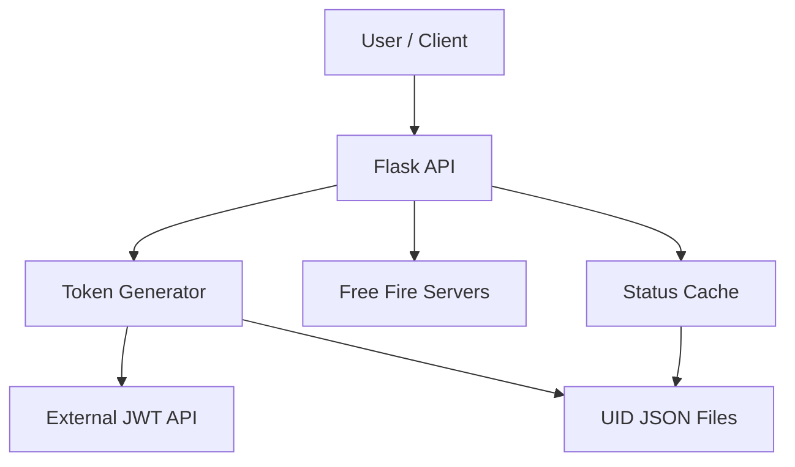
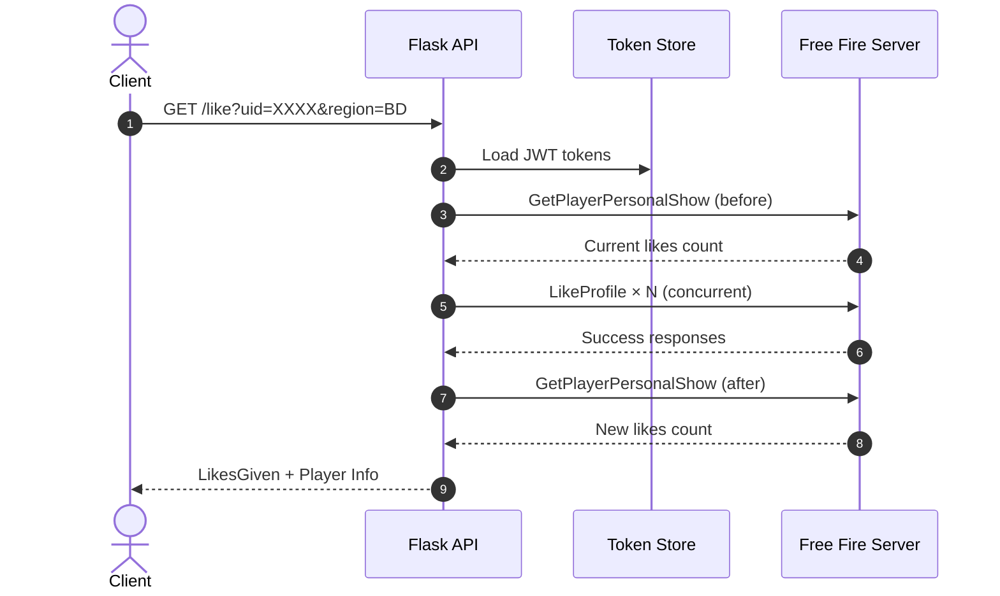

**𝐅𝐅𝐋𝐈𝐊𝐄-𝟕𝐗**

<p align="center">
  
  
  
  
</p>

<p align="center"><b>𝐇𝐢𝐠𝐡-𝐒𝐩𝐞𝐞𝐝 𝐅𝐫𝐞𝐞 𝐅𝐢𝐫𝐞 𝐀𝐮𝐭𝐨-𝐋𝐢𝐤𝐞 𝐀𝐏𝐈</b></p>

<p align="center"><b>𝐓𝐨𝐤𝐞𝐧 𝐆𝐞𝐧 → 𝐁𝐮𝐥𝐤 𝐋𝐢𝐤𝐞 → 𝐒𝐭𝐚𝐭𝐮𝐬 𝐂𝐡𝐞𝐜𝐤 → 𝐀𝐮𝐭𝐨 𝐑𝐞𝐟𝐫𝐞𝐬𝐡</b></p>

<p align="center">
  𝐁𝐮𝐢𝐥𝐭 𝐟𝐨𝐫 <b>𝐁𝐃 / 𝐈𝐍𝐃 / 𝐁𝐑 / 𝐔𝐒</b> 𝐫𝐞𝐠𝐢𝐨𝐧𝐬<br>
  𝐂𝐨𝐦𝐩𝐥𝐞𝐭𝐞𝐥𝐲 𝐬𝐞𝐥𝐟-𝐜𝐨𝐧𝐭𝐚𝐢𝐧𝐞𝐝 𝐀𝐏𝐈 𝐰𝐢𝐭𝐡 𝐚𝐮𝐭𝐨𝐦𝐚𝐭𝐢𝐜 𝐭𝐨𝐤𝐞𝐧 𝐫𝐞𝐟𝐫𝐞𝐬𝐡.
</p>

---

## **📖 𝐎𝐯𝐞𝐫𝐯𝐢𝐞𝐰**

**𝐅𝐅𝐋𝐈𝐊𝐄-𝟕𝐗** 𝐢𝐬 𝐚 𝐡𝐢𝐠𝐡-𝐩𝐞𝐫𝐟𝐨𝐫𝐦𝐚𝐧𝐜𝐞 𝐅𝐫𝐞𝐞 𝐅𝐢𝐫𝐞 𝐚𝐮𝐭𝐨-𝐥𝐢𝐤𝐞 𝐞𝐧𝐠𝐢𝐧𝐞.

𝐈𝐭 𝐥𝐨𝐚𝐝𝐬 𝐚𝐜𝐜𝐨𝐮𝐧𝐭 𝐔𝐈𝐃𝐬, 𝐠𝐞𝐧𝐞𝐫𝐚𝐭𝐞𝐬 𝐉𝐖𝐓 𝐭𝐨𝐤𝐞𝐧𝐬, 𝐞𝐧𝐜𝐫𝐲𝐩𝐭𝐬 𝐫𝐞𝐪𝐮𝐞𝐬𝐭𝐬 𝐮𝐬𝐢𝐧𝐠 𝐀𝐄𝐒 + 𝐏𝐫𝐨𝐭𝐨𝐛𝐮𝐟, 𝐚𝐧𝐝 𝐬𝐞𝐧𝐝𝐬 𝐡𝐮𝐧𝐝𝐫𝐞𝐝𝐬 𝐨𝐟 𝐥𝐢𝐤𝐞𝐬 𝐭𝐨 𝐚𝐧𝐲 𝐩𝐥𝐚𝐲𝐞𝐫 𝐩𝐫𝐨𝐟𝐢𝐥𝐞 𝐢𝐧 𝐬𝐞𝐜𝐨𝐧𝐝𝐬.

𝐓𝐡𝐞 𝐬𝐲𝐬𝐭𝐞𝐦 𝐬𝐮𝐩𝐩𝐨𝐫𝐭𝐬 𝐦𝐮𝐥𝐭𝐢𝐩𝐥𝐞 𝐫𝐞𝐠𝐢𝐨𝐧𝐬, 𝐚𝐮𝐭𝐨𝐦𝐚𝐭𝐢𝐜 𝐭𝐨𝐤𝐞𝐧 𝐫𝐞𝐟𝐫𝐞𝐬𝐡 𝐞𝐯𝐞𝐫𝐲 𝟕 𝐡𝐨𝐮𝐫𝐬, 𝐚𝐧𝐝 𝐫𝐞𝐚𝐥-𝐭𝐢𝐦𝐞 𝐚𝐜𝐜𝐨𝐮𝐧𝐭 𝐡𝐞𝐚𝐥𝐭𝐡 𝐜𝐡𝐞𝐜𝐤𝐢𝐧𝐠.

---

## **✨ 𝐂𝐨𝐫𝐞 𝐅𝐞𝐚𝐭𝐮𝐫𝐞𝐬**

| 𝐅𝐞𝐚𝐭𝐮𝐫𝐞 | 𝐃𝐞𝐬𝐜𝐫𝐢𝐩𝐭𝐢𝐨𝐧 |
|---------|-------------|
| 🔥 **𝐁𝐮𝐥𝐤 𝐋𝐢𝐤𝐞 𝐄𝐧𝐠𝐢𝐧𝐞** | 𝐒𝐞𝐧𝐝 𝐡𝐮𝐧𝐝𝐫𝐞𝐝𝐬 𝐨𝐟 𝐥𝐢𝐤𝐞𝐬 𝐮𝐬𝐢𝐧𝐠 𝐚𝐥𝐥 𝐚𝐯𝐚𝐢𝐥𝐚𝐛𝐥𝐞 𝐭𝐨𝐤𝐞𝐧𝐬 |
| 🔑 **𝐀𝐮𝐭𝐨 𝐓𝐨𝐤𝐞𝐧 𝐆𝐞𝐧𝐞𝐫𝐚𝐭𝐨𝐫** | 𝐆𝐞𝐧𝐞𝐫𝐚𝐭𝐞𝐬 𝐉𝐖𝐓 𝐭𝐨𝐤𝐞𝐧𝐬 𝐟𝐫𝐨𝐦 𝐔𝐈𝐃 + 𝐩𝐚𝐬𝐬𝐰𝐨𝐫𝐝 𝐥𝐢𝐬𝐭 |
| 🔄 **𝐀𝐮𝐭𝐨 𝐑𝐞𝐟𝐫𝐞𝐬𝐡** | 𝐓𝐨𝐤𝐞𝐧𝐬 𝐫𝐞𝐟𝐫𝐞𝐬𝐡 𝐚𝐮𝐭𝐨𝐦𝐚𝐭𝐢𝐜𝐚𝐥𝐥𝐲 𝐞𝐯𝐞𝐫𝐲 𝟕 𝐡𝐨𝐮𝐫𝐬 |
| 🌍 **𝐌𝐮𝐥𝐭𝐢-𝐑𝐞𝐠𝐢𝐨𝐧** | 𝐒𝐮𝐩𝐩𝐨𝐫𝐭𝐬 𝐁𝐃, 𝐈𝐍𝐃, 𝐁𝐑, 𝐔𝐒, 𝐒𝐀𝐂, 𝐍𝐀 |
| 📊 **𝐀𝐜𝐜𝐨𝐮𝐧𝐭 𝐒𝐭𝐚𝐭𝐮𝐬** | 𝐂𝐡𝐞𝐜𝐤 𝐚𝐜𝐭𝐢𝐯𝐞 / 𝐢𝐧𝐚𝐜𝐭𝐢𝐯𝐞 𝐚𝐜𝐜𝐨𝐮𝐧𝐭𝐬 𝐢𝐧 𝐫𝐞𝐚𝐥-𝐭𝐢𝐦𝐞 |
| ⚡ **𝐇𝐢𝐠𝐡 𝐂𝐨𝐧𝐜𝐮𝐫𝐫𝐞𝐧𝐜𝐲** | 𝐔𝐩 𝐭𝐨 𝟓𝟎 𝐬𝐢𝐦𝐮𝐥𝐭𝐚𝐧𝐞𝐨𝐮𝐬 𝐥𝐢𝐤𝐞 𝐫𝐞𝐪𝐮𝐞𝐬𝐭𝐬 |
| 🔒 **𝐀𝐄𝐒 + 𝐏𝐫𝐨𝐭𝐨𝐛𝐮𝐟** | 𝐅𝐮𝐥𝐥 𝐞𝐧𝐜𝐫𝐲𝐩𝐭𝐢𝐨𝐧 𝐦𝐚𝐭𝐜𝐡𝐢𝐧𝐠 𝐨𝐟𝐟𝐢𝐜𝐢𝐚𝐥 𝐜𝐥𝐢𝐞𝐧𝐭 |
| ☁️ **𝐕𝐞𝐫𝐜𝐞𝐥 𝐑𝐞𝐚𝐝𝐲** | 𝐎𝐧𝐞-𝐜𝐥𝐢𝐜𝐤 𝐝𝐞𝐩𝐥𝐨𝐲𝐦𝐞𝐧𝐭 𝐨𝐧 𝐕𝐞𝐫𝐜𝐞𝐥 |

---

## **🏗️ 𝐒𝐲𝐬𝐭𝐞𝐦 𝐀𝐫𝐜𝐡𝐢𝐭𝐞𝐜𝐭𝐮𝐫𝐞**



---

## **🔄 𝐋𝐢𝐤𝐞 𝐋𝐢𝐟𝐞𝐜𝐲𝐜𝐥𝐞**



---

## **📱 𝐐𝐮𝐢𝐜𝐤 𝐒𝐭𝐚𝐫𝐭**

### 𝟏. 𝐂𝐥𝐨𝐧𝐞 & 𝐈𝐧𝐬𝐭𝐚𝐥𝐥

```bash
git clone https://github.com/exu-coder-9x/FFLIKE-7X.git
cd FFLIKE-7X
pip install -r requirements.txt
```

### 𝟐. 𝐏𝐫𝐞𝐩𝐚𝐫𝐞 𝐀𝐜𝐜𝐨𝐮𝐧𝐭𝐬

𝐂𝐫𝐞𝐚𝐭𝐞 `Uid_bd.json` (𝐨𝐫 𝐨𝐭𝐡𝐞𝐫 𝐫𝐞𝐠𝐢𝐨𝐧 𝐟𝐢𝐥𝐞𝐬):

```json
[
  {"uid": "1234567890", "password": "your_password"},
  {"uid": "0987654321", "password": "another_password"}
]
```

### 𝟑. 𝐑𝐮𝐧

```bash
python main.py
```

𝐒𝐞𝐫𝐯𝐞𝐫 𝐬𝐭𝐚𝐫𝐭𝐬 𝐨𝐧:

```
http://localhost:5000
```

---

## **🔌 𝐀𝐏𝐈 𝐄𝐧𝐝𝐩𝐨𝐢𝐧𝐭𝐬**

| 𝐄𝐧𝐝𝐩𝐨𝐢𝐧𝐭 | 𝐌𝐞𝐭𝐡𝐨𝐝 | 𝐃𝐞𝐬𝐜𝐫𝐢𝐩𝐭𝐢𝐨𝐧 |
|---------|--------|-------------|
| `/like?uid=XXX&region=BD` | 𝐆𝐄𝐓 | 𝐒𝐞𝐧𝐝 𝐥𝐢𝐤𝐞𝐬 𝐭𝐨 𝐚 𝐩𝐥𝐚𝐲𝐞𝐫 |
| `/like?uid=XXX&region=BD&count=50` | 𝐆𝐄𝐓 | 𝐒𝐞𝐧𝐝 𝐞𝐱𝐚𝐜𝐭𝐥𝐲 𝟓𝟎 𝐥𝐢𝐤𝐞𝐬 |
| `/remain` | 𝐆𝐄𝐓 | 𝐂𝐡𝐞𝐜𝐤 𝐝𝐚𝐢𝐥𝐲 𝐥𝐢𝐦𝐢𝐭 𝐫𝐞𝐦𝐚𝐢𝐧𝐢𝐧𝐠 |
| `/accounts/count?region=BD` | 𝐆𝐄𝐓 | 𝐓𝐨𝐭𝐚𝐥 / 𝐚𝐜𝐭𝐢𝐯𝐞 𝐚𝐜𝐜𝐨𝐮𝐧𝐭 𝐜𝐨𝐮𝐧𝐭 |
| `/accounts/status?region=BD&details=1` | 𝐆𝐄𝐓 | 𝐃𝐞𝐭𝐚𝐢𝐥𝐞𝐝 𝐚𝐜𝐜𝐨𝐮𝐧𝐭 𝐡𝐞𝐚𝐥𝐭𝐡 |

---

## **⚙️ 𝐂𝐨𝐧𝐟𝐢𝐠𝐮𝐫𝐚𝐭𝐢𝐨𝐧**

| 𝐊𝐞𝐲 | 𝐏𝐮𝐫𝐩𝐨𝐬𝐞 | 𝐃𝐞𝐟𝐚𝐮𝐥𝐭 |
|-----|---------|---------|
| `JWT_API_URL` | 𝐄𝐱𝐭𝐞𝐫𝐧𝐚𝐥 𝐭𝐨𝐤𝐞𝐧 𝐠𝐞𝐧𝐞𝐫𝐚𝐭𝐨𝐫 | `https://token-jwt-obb.vercel.app/token` |
| `REFRESH_INTERVAL_HOURS` | 𝐀𝐮𝐭𝐨-𝐫𝐞𝐟𝐫𝐞𝐬𝐡 𝐢𝐧𝐭𝐞𝐫𝐯𝐚𝐥 | `7` |
| `LIKE_CONCURRENCY` | 𝐌𝐚𝐱 𝐬𝐢𝐦𝐮𝐥𝐭𝐚𝐧𝐞𝐨𝐮𝐬 𝐥𝐢𝐤𝐞𝐬 | `50` |
| `DAILY_LIMIT` | 𝐃𝐚𝐢𝐥𝐲 𝐥𝐢𝐤𝐞 𝐥𝐢𝐦𝐢𝐭 𝐜𝐨𝐮𝐧𝐭𝐞𝐫 | `300` |
| `SERVER_PORT` | 𝐅𝐥𝐚𝐬𝐤 𝐩𝐨𝐫𝐭 | `5000` |

---

## **🛠️ 𝐓𝐞𝐜𝐡𝐧𝐨𝐥𝐨𝐠𝐲 𝐒𝐭𝐚𝐜𝐤**

| 𝐋𝐚𝐲𝐞𝐫 | 𝐓𝐞𝐜𝐡𝐧𝐨𝐥𝐨𝐠𝐲 |
|-------|------------|
| **𝐀𝐏𝐈** | 𝐅𝐥𝐚𝐬𝐤 (𝐚𝐬𝐲𝐧𝐜) |
| **𝐇𝐓𝐓𝐏** | 𝐚𝐢𝐨𝐡𝐭𝐭𝐩 + 𝐫𝐞𝐪𝐮𝐞𝐬𝐭𝐬 |
| **𝐂𝐫𝐲𝐩𝐭𝐨** | 𝐩𝐲𝐜𝐫𝐲𝐩𝐭𝐨𝐝𝐨𝐦𝐞 (𝐀𝐄𝐒-𝐂𝐁𝐂) |
| **𝐒𝐞𝐫𝐢𝐚𝐥𝐢𝐳𝐚𝐭𝐢𝐨𝐧** | 𝐆𝐨𝐨𝐠𝐥𝐞 𝐏𝐫𝐨𝐭𝐨𝐛𝐮𝐟 |
| **𝐓𝐨𝐤𝐞𝐧 𝐌𝐚𝐧𝐚𝐠𝐞𝐦𝐞𝐧𝐭** | 𝐀𝐮𝐭𝐨-𝐫𝐞𝐟𝐫𝐞𝐬𝐡 𝐛𝐚𝐜𝐤𝐠𝐫𝐨𝐮𝐧𝐝 𝐭𝐡𝐫𝐞𝐚𝐝 |
| **𝐃𝐞𝐩𝐥𝐨𝐲𝐦𝐞𝐧𝐭** | 𝐕𝐞𝐫𝐜𝐞𝐥 / 𝐋𝐨𝐜𝐚𝐥 𝐏𝐲𝐭𝐡𝐨𝐧 |

---

## **📌 𝐃𝐞𝐬𝐢𝐠𝐧 𝐏𝐡𝐢𝐥𝐨𝐬𝐨𝐩𝐡𝐲**

𝐅𝐅𝐋𝐈𝐊𝐄-𝟕𝐗 𝐢𝐬 𝐛𝐮𝐢𝐥𝐭 𝐚𝐫𝐨𝐮𝐧𝐝 𝐭𝐡𝐫𝐞𝐞 𝐩𝐫𝐢𝐧𝐜𝐢𝐩𝐥𝐞𝐬:

- **𝐒𝐩𝐞𝐞𝐝-𝐟𝐢𝐫𝐬𝐭** — 𝐌𝐚𝐱𝐢𝐦𝐮𝐦 𝐜𝐨𝐧𝐜𝐮𝐫𝐫𝐞𝐧𝐜𝐲 𝐰𝐢𝐭𝐡 𝐬𝐚𝐟𝐞 𝐥𝐢𝐦𝐢𝐭𝐬  
- **𝐙𝐞𝐫𝐨 𝐦𝐚𝐧𝐮𝐚𝐥 𝐰𝐨𝐫𝐤** — 𝐓𝐨𝐤𝐞𝐧𝐬 𝐫𝐞𝐟𝐫𝐞𝐬𝐡 𝐚𝐮𝐭𝐨𝐦𝐚𝐭𝐢𝐜𝐚𝐥𝐥𝐲  
- **𝐌𝐮𝐥𝐭𝐢-𝐫𝐞𝐠𝐢𝐨𝐧** — 𝐎𝐧𝐞 𝐜𝐨𝐝𝐞𝐛𝐚𝐬𝐞 𝐟𝐨𝐫 𝐚𝐥𝐥 𝐬𝐞𝐫𝐯𝐞𝐫𝐬  

---

## **⚠️ 𝐃𝐢𝐬𝐜𝐥𝐚𝐢𝐦𝐞𝐫**

**𝐅𝐨𝐫 𝐞𝐝𝐮𝐜𝐚𝐭𝐢𝐨𝐧𝐚𝐥 𝐚𝐧𝐝 𝐩𝐞𝐫𝐬𝐨𝐧𝐚𝐥 𝐮𝐬𝐞 𝐨𝐧𝐥𝐲.**

𝐓𝐡𝐢𝐬 𝐭𝐨𝐨𝐥 𝐢𝐬 𝐧𝐨𝐭 𝐚𝐟𝐟𝐢𝐥𝐢𝐚𝐭𝐞𝐝 𝐰𝐢𝐭𝐡 𝐆𝐚𝐫𝐞𝐧𝐚 𝐨𝐫 𝐅𝐫𝐞𝐞 𝐅𝐢𝐫𝐞.  
𝐔𝐬𝐢𝐧𝐠 𝐚𝐮𝐭𝐨𝐦𝐚𝐭𝐢𝐨𝐧 𝐭𝐨𝐨𝐥𝐬 𝐦𝐚𝐲 𝐯𝐢𝐨𝐥𝐚𝐭𝐞 𝐭𝐡𝐞 𝐠𝐚𝐦𝐞'𝐬 𝐓𝐞𝐫𝐦𝐬 𝐨𝐟 𝐒𝐞𝐫𝐯𝐢𝐜𝐞.  
𝐘𝐨𝐮 𝐚𝐫𝐞 𝐬𝐨𝐥𝐞𝐥𝐲 𝐫𝐞𝐬𝐩𝐨𝐧𝐬𝐢𝐛𝐥𝐞 𝐟𝐨𝐫 𝐚𝐧𝐲 𝐜𝐨𝐧𝐬𝐞𝐪𝐮𝐞𝐧𝐜𝐞𝐬.

---

## **📜 𝐋𝐢𝐜𝐞𝐧𝐬𝐞**

**𝐌𝐈𝐓 𝐋𝐢𝐜𝐞𝐧𝐬𝐞**

𝐓𝐡𝐢𝐬 𝐩𝐫𝐨𝐣𝐞𝐜𝐭 𝐢𝐬 𝐚 𝐡𝐢𝐠𝐡-𝐩𝐞𝐫𝐟𝐨𝐫𝐦𝐚𝐧𝐜𝐞 𝐅𝐫𝐞𝐞 𝐅𝐢𝐫𝐞 𝐥𝐢𝐤𝐞 𝐀𝐏𝐈 𝐟𝐨𝐜𝐮𝐬𝐞𝐝 𝐨𝐧 𝐬𝐩𝐞𝐞𝐝, 𝐬𝐭𝐚𝐛𝐢𝐥𝐢𝐭𝐲, 𝐚𝐧𝐝 𝐚𝐮𝐭𝐨𝐦𝐚𝐭𝐢𝐜 𝐭𝐨𝐤𝐞𝐧 𝐦𝐚𝐧𝐚𝐠𝐞𝐦𝐞𝐧𝐭.

---

<p align="center">
  <b>𝐅𝐅𝐋𝐈𝐊𝐄-𝟕𝐗</b><br>
  𝐓𝐨𝐤𝐞𝐧 → 𝐄𝐧𝐜𝐫𝐲𝐩𝐭 → 𝐋𝐢𝐤𝐞 → 𝐑𝐞𝐟𝐫𝐞𝐬𝐡
</p>
```
